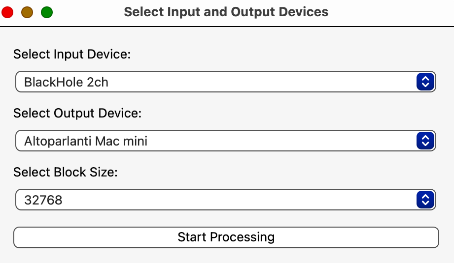
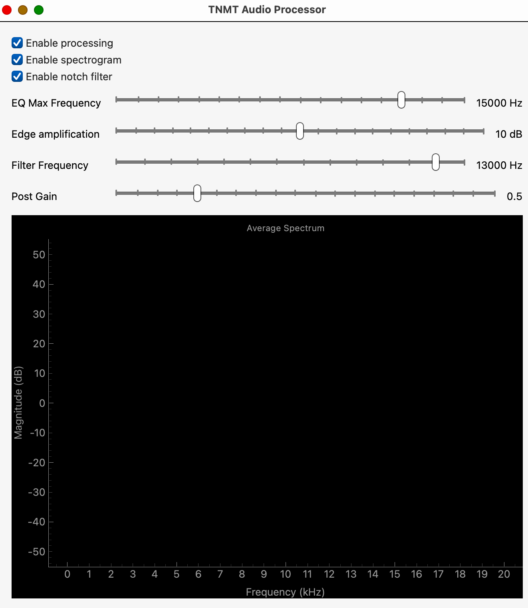

# TNMT Audio Processor

TNMT Audio Processor is an implementation of the audio processing pipeline described in the article "Clinical trial on tonal tinnitus with tailor-made notched music training" by Pantev et al. (2016). The pipeline includes a multi-band auto equalizer, a notch filter around tinnitus frequency, and edge amplification at the notch filter boundaries.
Research paper reference: <a href="https://link.springer.com/content/pdf/10.1186/s12883-016-0558-7.pdf" target="_blank">Clinical trial on tonal tinnitus with tailor-made notched music training</a>

- This app is tested and distributed only for macOS!
- Some latency is required to keep up the quality of the processed audio, so it's not recommended to use this program for watching videos.
- This program is NOT highly optimized. On my Mac mini it consumes around 20% of CPU time.
- This program seems to work quite well as an audio enhancer too! Try it on your favourite music and hear the difference. 

## How does it work?

It receives routed audio from the soundcard of your computer (for routing audio you need to install a specific program, see [Prerequisites](#prerequisites) below) and processes it:
- first, an automatic equalizer redistributes audio energy between high and low frequency bands
- second, a notch filter removes frequencies around your tinnitus frequency (so move the filter frequency slider to your perceived tinnitus frequency). If you don't know your tinnitus frequency just use a tone generator like the one at <a href="https://onlinesound.net/tone-generator" target="_blank">onlinesound.net</a> (the research paper mentions a more sopisticated protocol that has yet to be implemented in the program).

## Prerequisites

- Install BlackHole virtual device for audio loopback (separate download):
  - Download BlackHole (2 channels version) from <a href="https://existential.audio/blackhole/" target="_blank">existential.audio</a>
  - Open the downloaded .pkg file and follow the installation instructions.
  - Open the "Audio MIDI Setup" application on macOS (press cmd+space and search "audio midi setup" if you can't locate it).
  - Set "BlackHole 2ch" as the default output device (right click on the device and select the menu item "Use this device for sound output").
    
## Installation and Usage

- Download the [latest release](https://github.com/flosSoftware/tinnitus_therapy/releases/download/v0.1.0-alpha/TNMT.dmg).
- Open the image file TNMT.dmg and move the TNMT app in the macOS Applications folder.
- Run the TNMT app:
  - Select "BlackHole 2ch" as the input device and your soundcard/sound monitors as the output device.
  
  - Click "Start Processing".
  - Allow permission to use the microphone.
  - Enjoy your music! If you want, you can disable the entire processing (EQ + filtering) or only the notch filtering. If you don't need to look at the spectrogram you can disable to save some CPU time.
  

## Known issues

The program amplifies noise in the silent parts (let the prgram author know if it's bothersome).

## Disclaimer

- This application is not a medical device and is not intended for the treatment of tinnitus. Use it at your own risk. Consult with a healthcare professional before using any audio processing tools for medical purposes.

## License

- This program is licensed under the GPL License. See the LICENSE file for details.
